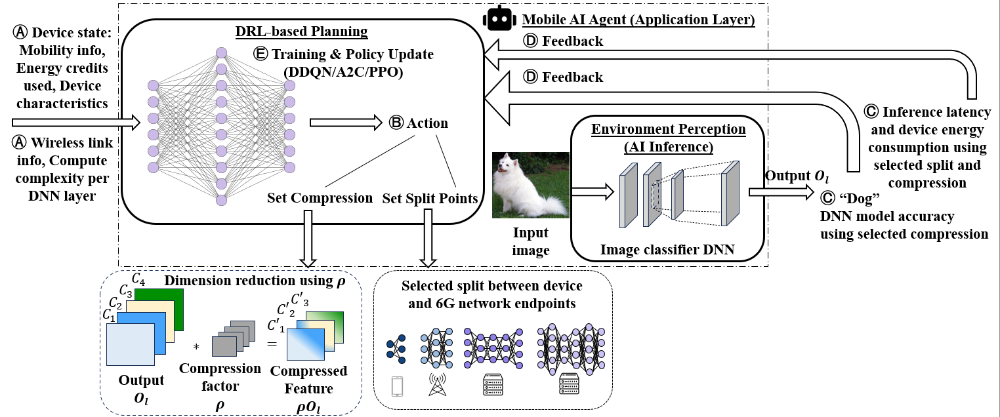

# splitAi-6g

splitai-6g is an implementation of our proposed framework **EnSplit+** for **layer-wise partitioning of Deep Neural Networks (DNNs)** across heterogeneous computation nodes in **6G edge-cloud environments**. The framework focuses on **energy-efficient and low-latency collaborative inference**, where DNN layers are dynamically split and deployed across User Equipment (UE), gNB, Edge, and Core, factoring in subscriber-level energy credit control. **EnSplit+** additionally supports discrete UE-side compression levels, capturing the resulting trade-off between compression and application accuracy.

## Overview of **EnSplit+**



## Features

- Layer-based DNN partitioning with multi-node support
- Optimization framework minimizing total inference latency and UE energy consumption
- FLOPs-based computation time and energy modeling
- Communication cost modeling with UE-specific energy
- Energy credit mechanism for managing UE energy budget during collaborative inference
- Deep Reinforcement learning (DRL) environment for adaptive split and compression decisions, with three
  supported algorithms: **DDQN**, **A2C**, and **PPO**
- Non-RL baseline algorithms for comparison: an optimal (exhaustive-search) solver, a single-objective
  energy-minimizing heuristic, random split selection, a fixed split configuration, and a UE-only
  (no-split) baseline
- Post-processing tooling for training convergence, KPI comparison across algorithms and operating
  conditions, and evaluation of DRL policy robustness/generalization to new data

## RL Algorithms
 
**EnSplit+** learns the joint split-point and compression-level decision using DRL.
Three algorithms are implemented and directly comparable within the same training and evaluation
pipeline:
 
- **DDQN** (Double Deep Q-Network) — a value-based, off-policy algorithm trained from a replay buffer of
  past experience. Serves as the primary, most extensively evaluated RL baseline in this project.
- **A2C** (Advantage Actor-Critic) — an on-policy, policy-gradient algorithm that jointly learns a policy
  and a value function from freshly collected rollouts.
- **PPO** (Proximal Policy Optimization) — an on-policy algorithm using a clipped surrogate objective and
  Generalized Advantage Estimation (GAE) to bound how far each policy update can move, aimed at more
  stable training than standard policy-gradient methods.
## Benchmarks
 
DDQN, A2C, and PPO are each evaluated against a common set of non-RL baselines:
 
- **OPT** — an exhaustive-search solver that returns the true optimal split and compression configuration
  for a given state, used as the ground-truth reference (performance upper bound) throughout this project.
- **HEURISTIC** — a lightweight, reactive, single-objective algorithm that greedily minimizes UE energy
  consumption subject to hard latency, accuracy, and energy-credit constraints, with no learning and no
  lookahead.
- **RANDOM** — samples a split and compression configuration at random each time step.
- **FIXED** — always uses the same, pre-determined split and compression configuration.
- **UE-only (no-split)** — executes the full model on-device, with no offloading.
## Key Findings
 
- The learned DRL policies (DDQN, A2C, PPO) consistently outperform the non-RL baselines in jointly
  balancing the inference latency-energy and compression-accuracy trade-offs, across the range of network
  throughput and latency-deadline conditions evaluated.
- Even a carefully designed, adaptive HEURISTIC baseline is structurally limited relative to the learned
  policies, particularly under tight latency deadlines and time-varying channel conditions, where a
  reactive search process cannot always identify a good configuration before conditions change again.
- Generalization behavior differs across the RL algorithms and depends on what is being generalized to:
  PPO's bounded policy updates are associated with better generalization to unseen operating points within
  the training distribution, while consistency across independent samples of the training distribution
  itself does not show the same clear ordering across algorithms. This remains an area of ongoing
  evaluation in the project.

## Repository Structure

- **splitAi-6g/**
  - **models/**
    - `vgg16_model.py` → VGG16 model definition
    - `convert_pretrained_vgg16.py` → Script to convert and save pretrained VGG16 weights
  - **nodes/**
    - `ue_node.py` → UE class handling compute & energy
    - `network_node.py` → Network compute node class (gNB/Edge/Core)
  - **utils/**
    - `action_space.py` → Generates the feasible split configurations
    - `comm_utils.py` → Communication latency and energy modeling utilities
    - `energy_utils.py` → UE-specific energy consumption functions
    - `flop_utils.py` → FLOPs computation time calculation
    - `flops_profile.py` → FLOPs per-layer (segment) profiler using flattened VGG16 layers
    - `inference_utils.py` → Computes the inference time and ue energy for the selected split config
    - `logging_utils.py` → Functions related to reading and writing experiment logs
    - `optimum.py` → Solves the optimization problem and returns the optimal split for the given inputs
    - `param_generator.py` → Generates random CPU frequencies, FLOPs, bandwidth
    - `rl_utils.py` → RL-specific utility functions
    - `scenario_generator.py` → Reads and packs scenario params from config file
    - `split_generator.py` → Non-RL baseline algorithms: random split generation, the energy-minimizing
      heuristic, the fixed split configuration, and the UE-only (no-split) baseline
  - **rl/**
    - **initial_models/** → stores initial model params for a given number of states and actions
    - **inference_checkpoints/** → stores inference checkpoints for DRL robustness evaluation
    - `generate_model_params.py` → script to instantiate RL model architecture and save initial model params
    - `ddqn.py` → defines the DDQN algorithm and associated functions and parameters
    - `a2c.py` → defines the A2C algorithm and associated functions and parameters
    - `ppo.py` → defines the PPO algorithm (clipped surrogate objective, GAE) and associated functions and parameters
    - `agent.py` → defines the RL agent and associated functions to execute training or inference across DDQN, A2C, and PPO
    - `replay_buffer.py` → defines the replay/rollout buffer used to store experiences for the DDQN and PPO algorithms
  - **logs/**
    - **random/** → stores kpis and logs of a random split generator
    - **rl/** → stores kpis and logs of rl-based algorithms
      - **ddqn/**
        - **models/** → stores the model params at the end of each training episode
      - **a2c/**
        - **models/** → stores the model params at the end of each training episode
      - **ppo/**
        - **models/** → stores the model params at the end of each training episode
    - **optimum/** → stores kpis and logs of the optimal solution
  - **postprocessing/**
    - `plot_system_kpis.py` → script that reads, parses and plots system kpis
    - `network_throughput.py` → plots KPIs (inference time, UE energy, accuracy) across algorithms as a function of network throughput
    - `inference_deadline.py` → plots KPIs across algorithms as a function of the maximum tolerable inference deadline
    - `convergence.py` → plots training convergence (reward, actor loss, critic loss) for the RL algorithms
    - `generalization.py` → evaluates DRL policy robustness/generalization: aggregate percentage error
      (MAPE and symmetric MAPE) of each DRL algorithm relative to OPT on a held-out dataset, and relative
      to each algorithm's own training-distribution performance
  - **results/**
  - `main.py` → End-to-end collaborative inference evaluation
  - `README.md` → Project documentation

## Pretrained Weights Setup

Before running the main collaborative inference script, you need to convert and save pretrained VGG16 weights for the custom model.
This step only needs to be run **once**:

```bash
python3 models/convert_pretrained_vgg16.py
```
## RL model params setup

Before running the main collaborative inference script, you need to instantiate the RL model architecture and save the weights and biases.
This step only needs to be run **once**:

```bash
python3 rl/generate_model_params.py
```

## Running SplitAI Inference

After setting up the pretrained weights, you can run the SplitAI collaborative inference:

```bash
python3 main.py
```

The algorithm used (RL-based, or one of the non-RL baselines) and, for RL runs, which of DDQN/A2C/PPO to
use, are set via `config.ini` (see `SPLIT_ALGORITHM` and `RL_ALGORITHM`).

## Post-processing and Evaluation

After running `main.py` for the desired algorithm(s), the `postprocessing/` scripts read the resulting
logs to produce the comparison figures and robustness/generalization evaluation described above, e.g.:

```bash
python3 postprocessing/generalization.py --algorithms ddqn a2c ppo
```

See each script's module docstring for the specific log locations it expects.